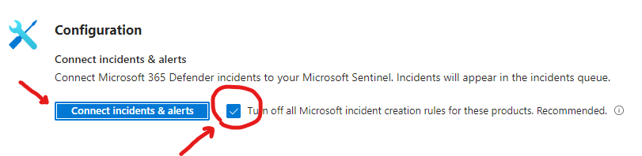

[[_TOC_]]

# **1 Changes in Microsoft Sentinel**

***

## **1.1 Changes in Data Connectors**

### **1.1.1 Enable Microsoft 365 Defender data connector**

> **Pre-requitites**:
>
> - **Workspace**: read and write permissions.
> - **Connector Access Control**: the user applying changes to the connector must be a member of the Azure Active Directory (AAD) associated with the tenant that the workspace belongs to.
> - **Tenant Permissions**: 'Global Administrator' or 'Security Administrator' on the workspace's tenant.
> - **License**: M365 E5, M365 A5 or any other Microsoft 365 Defender eligible license.

1. Go to the Customer Sentinel workspace
1. Select **Configuration --> Data connectors**
1. Search for **Microsoft 365 Defender**
1. Select the **Microsoft 365 Defender** data connector and select **Open connector page**
1. Under **Configuration**, select **Connect incidents & alerts** and ensure the checkbox corresponding to **Turn off all Microsoft incident creation rules for these products** is checked

6. Select **Go the UEBA configuration page** under **Connect entities** and do the following:

    1. Ensure UEBA feature is **On**
    1. Enable **Active Directory** and **Azure Active Directory** by selecting the corresponding check boxes
    1. Select **Apply**
    1. Enable **Audit Logs**, **Azure Activity**, **Security Events** and **Signin Logs** by selecting the corresponding check boxes
    1. Select **Apply**

> **NOTE**:
>
> Only a Global Administrator or a Security Administrator in  Azure Active Directory can turn UEBA feature on

7. Go to **Configuration --> Analytics** and ensure the following rules are disabled or removed:
    - Create incidents based on Microsoft Defender for Endpoint alerts
    - Create incidents based on Microsoft Defender for Identity alerts
    - Create incidents based on Microsoft Cloud App Security alerts
    - Create incidents based on Microsoft Defender for Office 365 alerts
    - Create incidents based on Azure Active Directory Identity Protection alerts

> **NOTE**:
>
> Failing to disable these Analytic rules will cause alert/incident duplication

### **1.1.2 Enable Defender for Cloud Data connector**
1. Select **Configuration --> Data connectors**
1. Search for **Microsoft Defender for Cloud**
1. Select the **Microsoft Defender for Cloud** data connector and select **Open connector page**
1. For each subscription, toggle the status switch to **Connected** and set Bi-directional sync to **Enabled**

## **1.2 Remove any automation rule closing ALL Incidents**
1. Select **Configuration --> Automation**
1. Select **Automation rules**
1. From the list of Automation rules, remove or disable any rule automatically closing **ALL** incidents. 
    - To remove the rule:
        - Select the Automation rule by selecting the corresponding check box
        - Select **Remove**
    - To disable the rule:
        - Select the Automation rule by selecting the corresponding check box
        - Select **Disable**

The rule to be removed/disable should look as follows:

## **1.3 Authorize Sentinel to execute playbooks in the new Resource group**
1. Go to the Azure portal
1. Open the Sentinel workspace corresponding to the customer
1. Select **Settings --> Settings**
1. Open the **Playbook permissions** section
1. Select **Configure prtmissions**
1. Select the Resource group created in the previous step
1. Select **Apply**

## **1.4 Create Automation rule to automatically close Informational incidents**

> **NOTE**:
>
> This Automation rule will be created by the CI/CD pipeline. Manual steps are provided as a backup method

1. Go to the Azure portal
1. Open the Sentinel workspace corresponding to the suer
1. Select **Automation**
1. Select **Automation rules**
1. Select **Create --> Automation rule**
1. Provide a name (e.g. **"Suppression rule: Close informational incidents"**)
1. Select trigger: **"When incident is created"**
1. Configure the following conditions:
    - If incident provider: "Equals" - "All", and
    - Analytic rule name: "Contains" - "All", and
    - Severity: "Equals" - "Informational"
1. Create the following action:
    - Change status: **"Closed"**
    - Select classification: **"Benign Positive: Suspicious but expected"**
    - Add comment: **"Automatically closed Informational incident - To be used during investigations or Threat Hunting"**
1. Create the following action:
    - Add tags, and add the following tags:
        - "Auto-closed"
1. Set Rule expiration: **Indefinite**
1. Set Order: **4**
1. set Status: **Enabled**

## **1.5 Create automation rules for Incident/Alert suppression**
> Add steps here !Figure out best deployment model

# **2 Changes to Lighthouse delegation**

***

## **2.1 Creation of new Resource group and corresponding Lighthouse delegation**

1. Go to the Azure portal
1. Search for **Deploy a custom template**
1. Select **Build your own template in the editor**
1. Select **Load file**
1. Locate the file [**integrationDelegations.json**](https://github.com/Difenda/MDR-Onboard/blob/main/Scripts/Shield2.0/integrationDelegations.json) and click **Open**
1. Select **Save**
1. Verify the data

> **NOTE**:
>
> Confirm Resource group name with the customer as well as the location before executing

8. Select **Review + create**
8. Select **Create**

## **2.2 Update Lighthouse delegation for Sentinel Resource group**

1. Go to the Azure portal
1. Search for **Deploy a custom template**
1. Select **Build your own template in the editor**
1. Select **Load file**
1. Locate the file [**sentinelDelegations.json**](https://github.com/Difenda/MDR-Onboard/blob/main/Scripts/Shield2.0/sentinelDelegations.json) and click **Open**
1. Select **Save**
1. Verify the data

> **NOTE**:
>
> Confirm Resource group name with the customer as well as the location before executing

8. Select **Review + create**
8. Select **Create**

# **3 Changes to access to Azure tenant**

***

## **Creation of new App registration (Service Principal) for Incident triage - Read Only**
1. Go to the Azure portal
1. Select **Azure Active Directory**
1. Select **App registrations**
1. Select **New registration**
1. Provide a name for the App registration, leave all other details default
1. Select **Register**
1. On the App registration details page, select **API permissions**
1. Select **Add permissions**, add the following permissions:

| API Name | App ID | Permission | Permission Type | Description |
|:--------:|--------|:----------:|:---:|:---|
| Microsoft Cloud App Security | 05a65629-4c1b-48c1-a78b-804c4abdd4af | investigation.read | Application |
| Microsoft Graph | 00000003-0000-0000-c000-000000000000 | MailboxSettings.Read | Application | Allows the app to the read user's mailbox settings. Does not include permission to send mail.|
| Microsoft Graph | 00000003-0000-0000-c000-000000000000 | User.Read.All | Application | Allows the app to read the full set of profile properties, group membership, reports and managers of other users in your organization, without a signed-in user.|
| Microsoft Graph | 00000003-0000-0000-c000-000000000000 | Reports.Read.All | Application | Allows an app to read all service usage reports without a signed-in user. Services that provide usage reports include Microsoft 365 and Azure Active Directory.|
| Microsoft Graph | 00000003-0000-0000-c000-000000000000 | RoleManagement.Read.Directory | Application |Allows the app to read the role-based access control (RBAC) settings for your company's directory, without a signed-in user. This includes reading directory role templates, directory roles and memberships.|
| Microsoft Graph | 00000003-0000-0000-c000-000000000000 | IdentityRiskyUser.Read.All | Application | Allows the app to read identity user risk information for all users in your organization without a signed-in user.|
| Microsoft Threat Protection | 8ee8fdad-f234-4243-8f3b-15c294843740 | AdvancedHunting.Read.All | Application |Run advanced queries|
| WindowsDefenderATP | fc780465-2017-40d4-a0c5-307022471b92 | AdvancedQuery.Read.All | Application |Allows the app to run advanced queries|
| WindowsDefenderATP | fc780465-2017-40d4-a0c5-307022471b92 | User.Read.All | Application |Allows the app to read all user profiles|
| WindowsDefenderATP | fc780465-2017-40d4-a0c5-307022471b92 | Machine.Read.All | Application |Allows the app to read all machine profiles, including the commands that were sent to each machine|
| WindowsDefenderATP | fc780465-2017-40d4-a0c5-307022471b92 | Vulnerability.Read.All | Application |Allows the app to read any Threat and Vulnerability Management vulnerability information|
| Log Analytics API | ca7f3f0b-7d91-482c-8e09-c5d840d0eac5 | Data.Read | Application |==Any additional IAM permissions required?==|

# **4 Changes for AVM Service**

***

## **Creation of new App registration (Service Principal) for AVM (or update existing)**
1. Go to the Azure portal
1. Select **Azure Active Directory**
1. Select **App registrations**
1. Select **New registration**
1. Provide a name for the App registration, leave all other details default
1. Select **Register**
1. On the App registration details page, select **API permissions**
1. Select **Add permissions**, add the following permissions:

| API Name | App ID | Permission | Permission Type | Description |
|:--------:|--------|:----------:|:---:|:---|
| WindowsDefenderATP | fc780465-2017-40d4-a0c5-307022471b92 | Machine.Read.All | Application |Allows the app to read all machine profiles, including the commands that were sent to each machine|
| WindowsDefenderATP | fc780465-2017-40d4-a0c5-307022471b92 | AdvancedQuery.Read.All | Application |Allows the app to run advanced queries|
| WindowsDefenderATP | fc780465-2017-40d4-a0c5-307022471b92 | User.Read.All | Application |Allows the app to read all user profiles|
| WindowsDefenderATP | fc780465-2017-40d4-a0c5-307022471b92 | Score.Read.All | Application |Allows the app to read any Threat and Vulnerability Management score|
| WindowsDefenderATP | fc780465-2017-40d4-a0c5-307022471b92 | RemediationTasks.Read.All | Application |Allows the app to read all remediation tasks|
| WindowsDefenderATP | fc780465-2017-40d4-a0c5-307022471b92 | SecurityRecommendation.Read.All | Application |Allows the app to read any Threat and Vulnerability Management security recommendation|
| WindowsDefenderATP | fc780465-2017-40d4-a0c5-307022471b92 | SecurityConfiguration.Read.All | Application |Allows the app to read all security configurations|
| WindowsDefenderATP | fc780465-2017-40d4-a0c5-307022471b92 | Software.Read.All | Application |Allows the app to read any Threat and Vulnerability Management software information|
| WindowsDefenderATP | fc780465-2017-40d4-a0c5-307022471b92 | Vulnerability.Read.All | Application |Allows the app to read any Threat and Vulnerability Management vulnerability information|
| Microsoft Threat Protection | 8ee8fdad-f234-4243-8f3b-15c294843740 | AdvancedHunting.Read.All | Application |Run advanced queries|
| Log Analytics API | ca7f3f0b-7d91-482c-8e09-c5d840d0eac5 | Data.Read | Application | ==Any additional IAM permissions required?==|
| Microsoft Graph | 00000003-0000-0000-c000-000000000000 | Device.Read.All | Application |Allows the app to read your organization's devices' configuration information without a signed-in user.|
| Microsoft Graph | 00000003-0000-0000-c000-000000000000 | ==Directory.ReadWrite.All== | Application |Allows the app to read and write data in your organization's directory, such as users, and groups, without a signed-in user. Does not allow user or group deletion.|
| Microsoft Graph | 00000003-0000-0000-c000-000000000000 | Group.Read.All | Application |Allows the app to read group properties and memberships, and read conversations for all groups, without a signed-in user.|
| Microsoft Graph | 00000003-0000-0000-c000-000000000000 | GroupMember.Read.All | Application |Allows the app to read memberships and basic group properties for all groups without a signed-in user.|
| Microsoft Graph | 00000003-0000-0000-c000-000000000000 | IdentityRiskyUser.Read.All | Application |Allows the app to read identity user risk information for all users in your organization without a signed-in user.|
| Microsoft Graph | 00000003-0000-0000-c000-000000000000 | Reports.Read.All | Application |Allows an app to read all service usage reports without a signed-in user. Services that provide usage reports include Microsoft 365 and Azure Active Directory.|
| Microsoft Graph | 00000003-0000-0000-c000-000000000000 | RoleManagement.Read.Directory | Application |Allows the app to read the role-based access control (RBAC) settings for your company's directory, without a signed-in user. This includes reading directory role templates, directory roles and memberships.|
| Microsoft Graph | 00000003-0000-0000-c000-000000000000 | ==User.Read== | Delegated |Allows users to sign-in to the app, and allows the app to read the profile of signed-in users. It also allows the app to read basic company information of signed-in users.|
| Microsoft Graph | 00000003-0000-0000-c000-000000000000 | ==User.Read.All== | Application |Allows the app to read the full set of profile properties, group membership, reports and managers of other users in your organization, without a signed-in user.|

# **5 Configure Single Sign-on for Shield access**

***

## **Configure Identity Provider on each customer AAD tenant**
1. Go to the Azure portal
1. Select **Azure Active Directory**
1. Select **Groups**
1. Select **New group**
1. Provide the following details
    - Group type: **Security**
    - Group name: (e.g.) DifendaShield-\<CUSTOMER\>-prod
    - Group description: "**Role group to access DifendaShield**"
    - Azure AD roles can be assigned to the group: **No**
    - Membership type: **Assigned**

>> NOTE: Create three (3) Azure Ad groups
>>
>>         1. [Customer] - IT Security Team (Will receive all notifications)
>>         2. [Customer] - High Priority Alert Group (Will receive notifications for HPI only)
>>         3. [Customer] - Shield Access (Will not receive incident related notifications)

1. Select **Create**
1. Select **Enterprise applications**
1. Select **New application**
1. Search for **ServiceNow**

10. Provide a name for the Enterprise application (e.g. DifendaShield Production)
10. Select **Create**
10. On the Enterprise application details page, select **Set up single sign on**

13. Select **SAML**

14. Edit the **Basic SAML Configuration** and provide the following values
    - Identifier (Entity ID): **https://difenda.service-now.com**
    - Reply URL (Assertion Consumer Service URL): **https://difenda.service-now.com/navpage.do**
    - Sign on URL: **https://difendadev.service-now.com/**

> **NOTE**:
>
> Discuss with @Key using custom domain (i.e. https://shield.difenda.com)

15. Edit the **Attributes & Claims** section and set the following:
    - givenname: **user.givenname**
    - surname: **user.surname**
    - emailaddress: **user.mail**
    - name: **user.userprincipalname**
    - Unique User Identifier: **user.mail**
15. Under the section **SAML Certificates**, select **Federation Metadata XML**
15. Provide this file to Difenda
15. In the **Enterprise application** details page, select **Assign users and groups**
15. Select **Add user/group**
15. Click on **None Selected**
15. Search for the 3 groups created previously (e.g. DifendaShield-\<CUSTOMER\>-prod)
15. Click on **Select**
15. Select **Assign**
15. Add the users that will have access to DifendaShield to the group **DifendaShield-\<CUSTOMER\>-prod**
